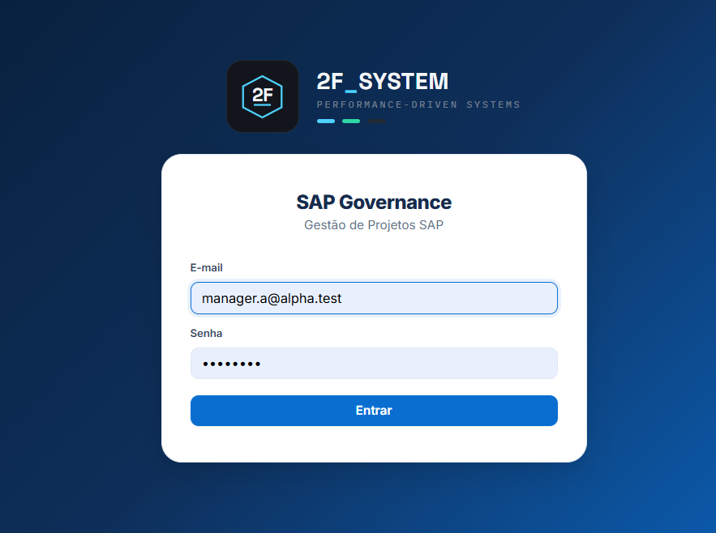
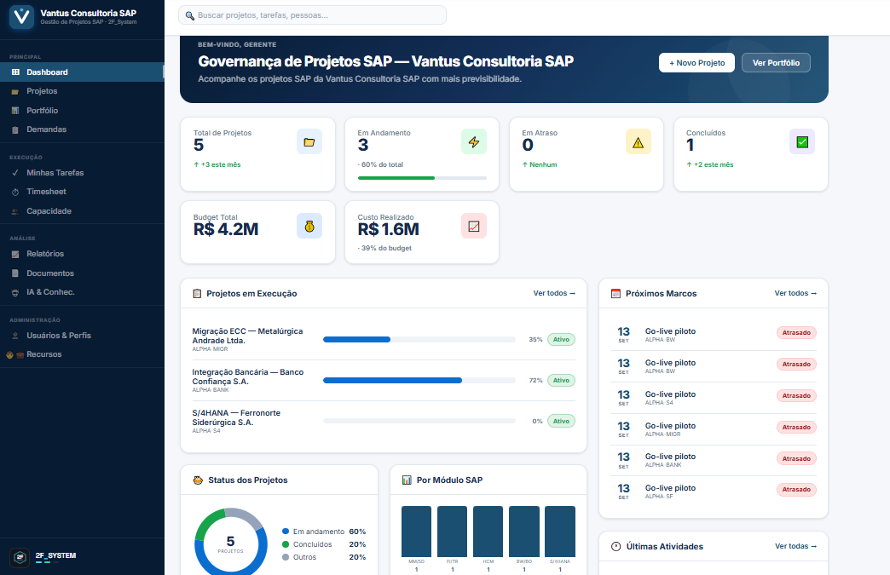
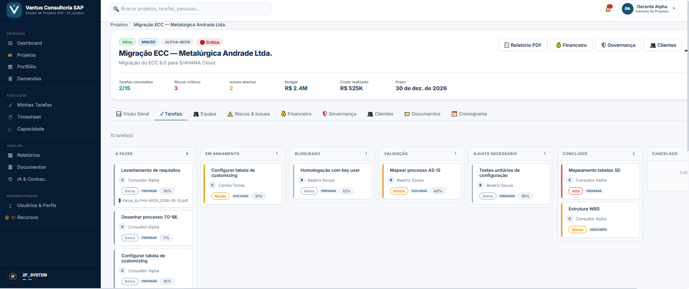
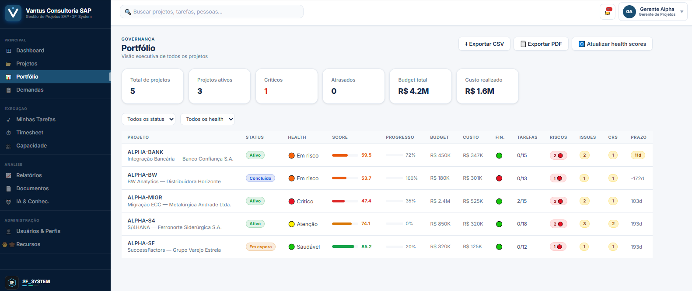
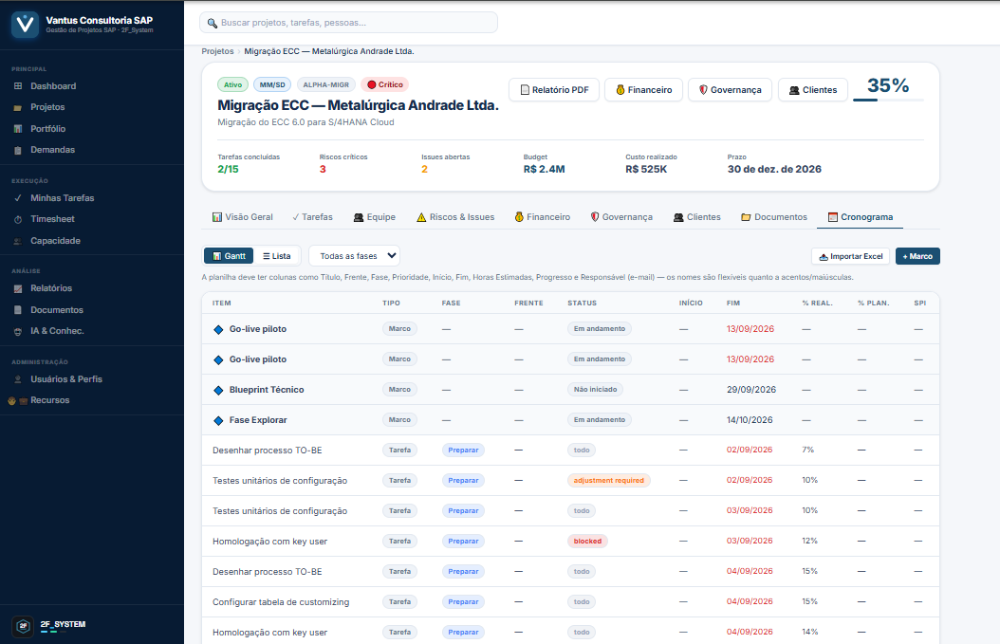
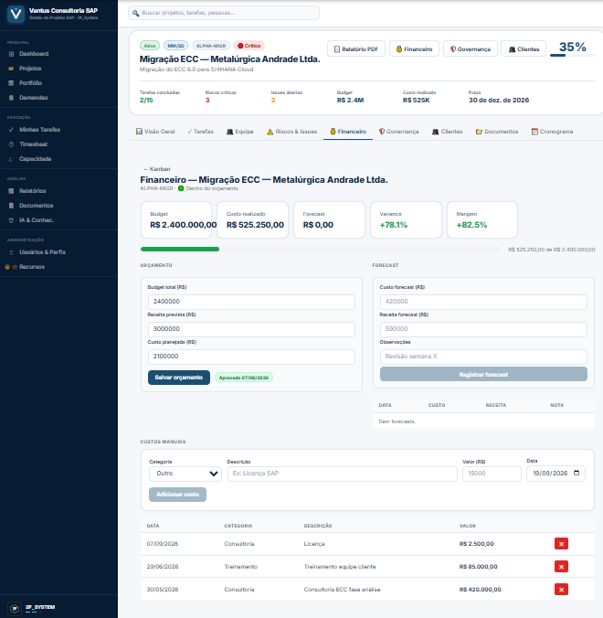

# 2F_System — SAP Project Governance Platform

**Plataforma SaaS multi-tenant para gestão de implementações SAP**, cobrindo todo o ciclo de um projeto de consultoria: portfólio, cronograma (SAP Activate), tarefas em Kanban com evidências auditáveis, alocação de recursos, horas, financeiro, riscos/issues/change requests, portal do cliente e geração de documentação técnica assistida por IA.

Desenvolvido como projeto solo, do zero, cobrindo modelagem de dados multi-tenant, segurança em nível de linha (RLS), automações no banco (triggers/views) e integração com IA generativa.

> ⚠️ Projeto de portfólio / estudo de caso. Dados de demonstração são fictícios.

---

## 🔗 Links

- **Demo:** `https://sap-project-governance-platform-ca4.vercel.app`
- **Repositório:** `https://github.com/feitosads22/SAP-PROJECT-GOVERNANCE-PLATFORM`

**Usuários de teste** (senha `teste123`):

| Papel | E-mail |
|---|---|
| Admin | `admin.a@alpha.test` |
| Gerente de Projeto | `manager.a@alpha.test` |
| Consultor | `consultant.a@alpha.test` |
| Cliente (portal) | `customer.a@alpha.test` |

---

## 📸 Screenshots

| Login | Dashboard |
|---|---|
|  |  |

| Kanban de Tarefas | Portfólio de Projetos |
|---|---|
|  |  |

| Cronograma (Gantt) | Financeiro |
|---|---|
|  |  |

---

## ✨ Principais funcionalidades

### Gestão de projetos e portfólio
- Multi-tenant real: cada organização (consultoria/cliente) só enxerga seus próprios dados, reforçado por **Row-Level Security** em todas as tabelas.
- Portfólio executivo com **health score calculado** (prazo, orçamento, riscos, qualidade de evidências, satisfação) e export CSV.
- Cadastro de projetos por metodologia **SAP Activate** (fases, módulos, frentes).

### Execução (Kanban + evidências)
- Quadro Kanban (drag-and-drop com `@dnd-kit`) por projeto, com cartões mostrando responsável, prazo, módulo e anexos de evidência.
- Fluxo de **evidência obrigatória**: tarefa só é aprovada/concluída após o gerente validar o anexo — reforçado por trigger no banco, não só na UI.
- Cartões **travados automaticamente** na coluna de Validação até a aprovação do gerente (evita burlar o fluxo arrastando o card).

### Cronograma e recursos
- Cronograma em lista + Gantt (cores por fase SAP, marcos, progresso).
- **Importação de cronograma via Excel** (mapeamento automático de colunas, datas e prioridades).
- Alocação de recursos e consultores por projeto, com % de dedicação e capacidade.
- Apontamento de horas (timesheet) semanal, com aprovação/rejeição pelo gestor.

### Financeiro e governança
- Orçamento planejado × realizado por mês, com gráfico comparativo.
- Riscos, issues e **Change Requests** com aprovação que atualiza orçamento/prazo automaticamente via trigger.

### Portal do cliente
- Área exclusiva para o cliente acompanhar status do próprio projeto, sem acesso a dados financeiros internos nem de outros projetos.
- Atualizações de status publicadas pelo time de projeto.

### Documentos e IA
- Geração automática de **Status Report semanal em PDF**, por projeto, salvo direto na aba de Documentos.
- **Geração de manual técnico com IA**: a partir das evidências já aprovadas de um projeto (ou de um módulo específico), a IA (Claude) sintetiza um manual técnico em Markdown organizado por módulo/frente e fase SAP Activate — sem inventar conteúdo de anexo, apenas referenciando os arquivos citados como fonte. Exportado automaticamente para PDF.
- Base de conhecimento com busca full-text.

### Colaboração e produtividade
- Comentários em tarefas, histórico de atividade.
- Busca global (projetos, tarefas, pessoas).
- Notificações em tempo real (Supabase Realtime).
- Dashboard do consultor: horas lançadas × planejadas e visão dos projetos em que está alocado (sem expor valores financeiros).

---

## 🛠️ Stack técnica

**Frontend:** React 18 · TypeScript · Vite · React Router · `@dnd-kit` (drag-and-drop) · jsPDF/jspdf-autotable · SheetJS (xlsx)

**Backend:** Supabase (Postgres, Auth, Row-Level Security, Storage, Realtime, Edge Functions em Deno)

**IA:** Anthropic Claude API (Edge Function server-side, chave nunca exposta no frontend)

**Deploy:** Vercel (frontend) + Supabase Cloud (backend)

---

## 🔐 Arquitetura de segurança (multi-tenant)

- Toda tabela possui `organization_id NOT NULL` e RLS habilitado.
- Políticas de RLS validam `organization_id = current_org_id()` **e** o papel do usuário (`admin`/`manager`/`consultant`/`customer`) em cada operação.
- Buckets do Storage seguem a mesma regra: o primeiro segmento do caminho do arquivo precisa ser o `organization_id` do usuário.
- `service_role` do Supabase nunca é usada no frontend — apenas a `anon key`; operações privilegiadas (convite de usuário, geração de manual com IA) rodam em **Edge Functions** server-side.
- Views de relatório marcadas com `security_invoker = true` para não vazar dados entre organizações mesmo quando a view é de propriedade de um role com bypass de RLS.

---

## 📂 Estrutura do projeto

```
src/
  pages/         # ~26 páginas (Dashboard, Kanban, Portfolio, Financeiro, Portal do Cliente, etc.)
  components/    # Kanban, modais de criação/edição, EvidencePanel, gráficos, sidebar/topbar
  lib/           # api.ts, pdf.ts, statusReport.ts, manuals.ts, scheduleImport.ts, comments.ts
  types/         # tipos compartilhados (app.types.ts)
supabase/
  migrations/    # migrations SQL sequenciais
  functions/     # Edge Functions (generate-manual, invite-user, ask-ai)
  seed/          # dados de demonstração fictícios
```

---

## 🚀 Rodando localmente

```bash
git clone https://github.com/feitosads22/SAP-PROJECT-GOVERNANCE-PLATFORM.git
cd SAP-PROJECT-GOVERNANCE-PLATFORM
npm install
cp .env.example .env   # preencha com sua URL/anon key do Supabase
npm run dev
```

---

## 👤 Autor

**Filipe Feitosa**
